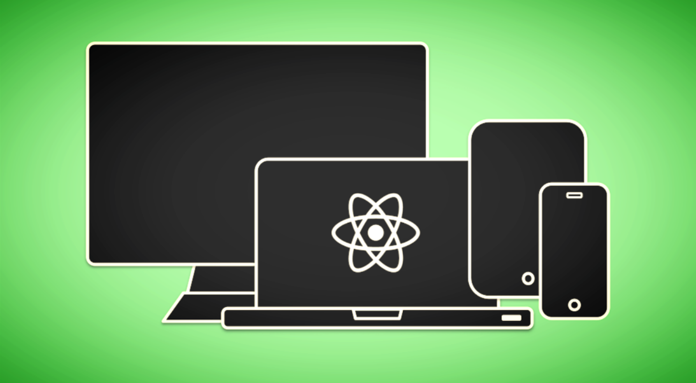

# React JS Web Development - The Essentials Bootcamp

Official repository guide to accompany the video lessons of the "React JS Web Development - The Essentials Bootcamp" course.

## Take the course here:
**[https://www.udemy.com/react-js-and-redux-mastering-web-apps/](https://www.udemy.com/react-js-and-redux-mastering-web-apps/)**

### Commit-by-lecture guide:
[https://github.com/15Dkatz/react-essentials-bootcamp-commits](https://github.com/15Dkatz/react-essentials-bootcamp-commits). This breaks down the course one commit at a time, per lecture, for an easier checkpoint/troubleshooting experience.

### What you'll learn:
* Updated for 2022-2023: Learn how to code with React, Redux, React Hooks, and more from an engineer with 5+ years of industry experience.
* Modern Redux in 2022-2023: modern syntax and best practices.
* React hooks in 2023-2023 - explore fundamental hooks, and build hooks from scratch.
* Learn React in 2022-2023 the right way and learn best practices, from an engineer with 5+ years of industry experience.
* Create industry-relevant projects that you can use on your portfolio and resume.
* Access 3+ hours of in-depth JavaScript material to hone your JS skills.
* Learn React the right way and learn best practices, from an engineer with 5+ years of industry experience.
* Modern React in 2022-2023: createStore, functional components, etc.
* Explore the React engine, and learn how it works under the hood to better understand the Virtual DOM, state, props, etc.
* Learn how to build applications from scratch, setting up your own react-app-template.
* See how React fits in the big picture of web development, with a ton of detailed overviews on what is happening in the browser and the React engine.

**This provides the completed projects for:**
- portfolio
- music-master
- react-app-template
- evens-or-odds
- starter
- react-hooks

**In this course, you will:**

**Dive into React code right away**. You will gain relevant experience as soon as the first section. Time is precious. And I want to make sure that you’ll never feel like you’re wasting it in this course. So in a matter of minutes, you will be writing React code in the first section, with a fully completed app by the end of it.

**Understand how React fits in the big picture of web development**. In the second section, you will take an important step back and examine how React fits in the big picture of web development. You’ll build a React project from scratch - discovering all the layers that are in between the supplies that supports the React app, and the browser which displays the React app.

**Create relevant and compelling React apps**. I’m betting you’ll find the apps both useful and interesting. Useful ones like the portfolio app will help you both learn React, and be valuable as a completed project for your software engineering and web developer profile. Fun ones like “Music Master”, will make coding lively, giving you apps you want to show off to your friends and family.
